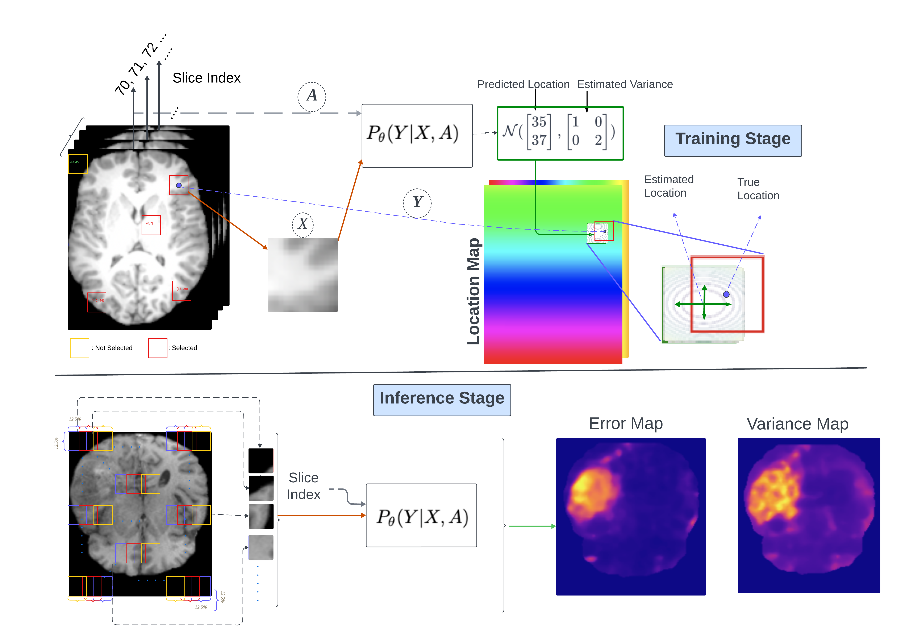

# Patch2Loc
Codebase for our Patch2Loc paper [Patch2Loc: Learning to Localize Patches for Unsupervised Brain Lesion Detection
](https://arxiv.org/abs/2506.22504).

**Abstract**: 
Detecting brain lesions as abnormalities observed in magnetic resonance imaging (MRI) is essential for diagnosis and treatment. In the search of abnormalities, such as tumors and malformations, radiologists may benefit from computer-aided diagnostics that use computer vision systems trained with machine learning to segment normal tissue from abnormal brain tissue. While supervised learning methods require annotated lesions, we propose a new unsupervised approach (Patch2Loc) that learns from normal patches taken from structural MRI. We train a neural network model to map a patch back to its spatial location within a slice of the brain volume. During inference, abnormal patches are detected by the relatively higher error and/or variance of the location prediction. This generates a heatmap that can be integrated into pixel-wise methods to achieve finer-grained segmentation. We demonstrate the ability of our model to segment abnormal brain tissues by applying our approach to the detection of tumor tissues in MRI on T2-weighted images from BraTS2021 and MSLUB datasets and T1-weighted images from ATLAS and WMH datasets. We show that it outperforms the state-of-the art in unsupervised segmentation. 
## Data
*I followed @FinnBehrendt data pre-processing*. 

We use the IXI data set, the BraTS21, MSLUB, ATLAS_v2 and WMH data set for our experiments. 
You can download/request the data sets here:

* [IXI](https://brain-development.org/ixi-dataset/)
* [BraTS21](http://braintumorsegmentation.org/)
* [MSLUB](https://lit.fe.uni-lj.si/en/research/resources/3D-MR-MS/)
* [ATLAS v2](https://fcon_1000.projects.nitrc.org/indi/retro/atlas.html)
* [WMH](https://dataverse.nl/dataset.xhtml?persistentId=doi:10.34894/AECRSD )

After downloading and processing the directory structure of <DATA_DIR> should look like this: 

    <DATA_DIR>
    ├── Train
    │   ├── ixi
    │   │   ├── mask
    │   │   ├── t2
    │    │  └── t1
    ├── Test
    │   ├── Brats21
    │   │   ├── mask
    │   │   ├── t2
    │   │   └──seg
    │   ├── MSLUB
    │   │   ├── mask
    │   │   ├── t2
    │   │   └── seg
    │   ├── ATLAS_v2
    │   │   ├── mask
    │   │   ├── t1
    │   │   └── seg
    │   └── ...
    ├── splits
    │   ├──  Brats21_test.csv        
    │   ├──  Brats21_val.csv   
    │   ├──  MSLUB_val.csv 
    │   ├──  MSLUB_test.csv
    │   ├──  IXI_train_fold0.csv
    │   ├──  IXI_train_fold1.csv 
    │   └── ...                
    └── ...

You should then specify the location of <DATA_DIR> in the pc_environment.env file. Additionally, specify the <LOG_DIR>, where runs will be saved. 
I have included my splits file in the `splits` directory here.  

## Environment Set-up
After cloning the repo, setup the conda env using the `requirements.txt` file:

> conda create --name <env> --file requirements.txt

## Run Experiments

To run the training of Patch2Loc, run 

    python run.py

If you look at the `configs/experiment/patch2loc.yaml` file, you will see `abnormality_analysis` which is used to
generate the KDE plots in the paper. If you want to test your model, run the same python command but make sure you
set these attributes to True in `configs/experiment/patch2loc.yaml`:
>test_after_training: True
> 
>onlyEval: True

and finally you set the `load_checkpoint` attribute to be  the *folder* where the checkpoints are located.  The folder should
have `checkpoints` file where all checkpoints are saved there. The code will take care of fetching the right checkpoint according the 
current fold

## Acknowledgment
 I'd like to thank @FinnBehrendt for sharing his base code. My data/test code is adopted from his contribution on GitHub. 

